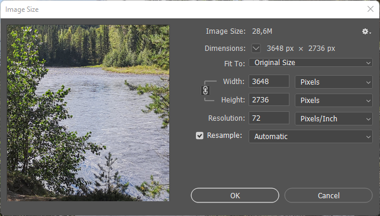
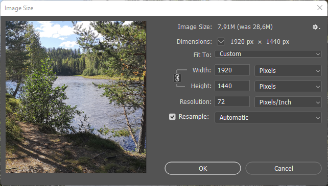
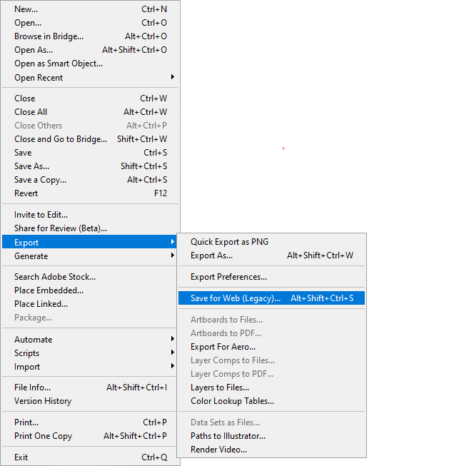
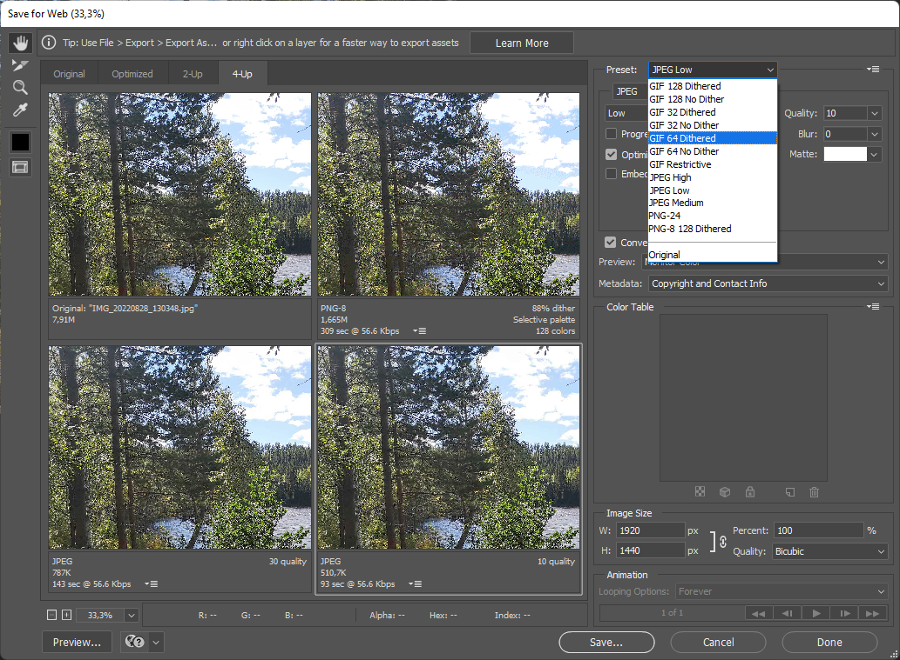
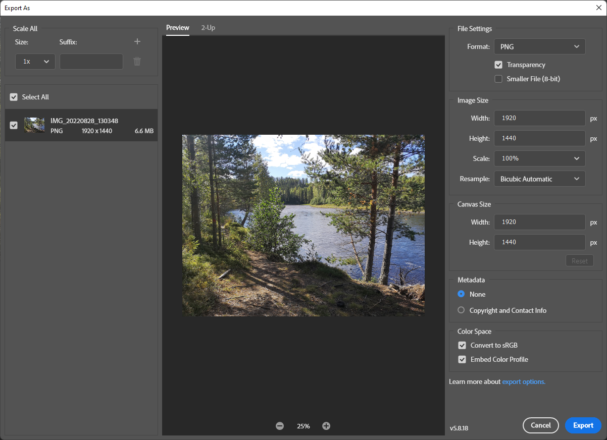

# Arbeta med bilder för webben

Scenario, du har en eller flera bilder som du vill använda på en webbplats. Bilderna är fotade med en mobiltelefon och har stor upplösning. Du vill att de ska visas på webbplatsen med en storlek som inte är större än vad som behövs för att visa dem på skärmen. Du vill också att de ska vara så lätta som möjligt att ladda ner.

En typisk upplösning för en sådan bild är någon form av 4k variant med JPG som format och en filstorlek på 4-8 MB. Det är för mycket för att visa på en webbplats. Det är också för mycket för att ladda ner på en mobiltelefon.

## Förberedelser

Den här guiden använder Photoshop, så du behöver det.

## Redigera bilden

Öppna bilden i Photoshop. Klicka på `Image` och sedan `Image Size`.



Ett första steg kan vara att ändra på bildens storlek här, utgå från vad bilden ska användas till. Detta är enbart några förslag, det är svårt att vara exakt.

- Bakgrund, om bilden ska användas som bakgrund på en webbplats, använd en storlek som är 1920x1080px.
- Logga, om bilden ska användas som logga på en webbplats, använd en storlek som är 300x300px.
- Bild, om bilden ska användas som bild på en webbplats, använd en storlek som är 800x600px.



När du har ändrat storleken på bilden, klicka på `OK`.

## Spara bilden

Klicka på `File` och sedan `Save As`.

### Spara för webben (legacy)

Photoshop har ett verktyg för att jämföra och spara bilden i format lämpligt för webben. Du hittar det i `File` menyn.



Verktyget kan visa bilden eller flera fönster med jämförelse, där kan du se kvalite samt storlek.



### Exportera bilden

Klicka på `File` och sedan `Export`.



## Nyare filformat anpassade till webben

[Artikel på MDN](https://developer.mozilla.org/en-US/docs/Web/Media/Formats/Image_types)

Flera av dessa format som WebP och AVIF är relativt nya och stöds inte av alla webbläsare. Eftersom stödet inte är 100% så kräver det att du kombinerar användadet av dessa format med `<picture>`elementet.

Det finns flera onlinekonverterare för dessa format som även kan optimera din bild.

# Utförandet

Att utföra arbetet med att ändra storleken på bilden är inte komplicerat. Men att göra det är otroligt viktigt men kan också vara tidskrävande, tråkigt och inte så kul. Men det måste ändå göras.

## Automatisera

Det finns flera verktyg som kan hjälpa dig att automatisera processen. Det finns också verktyg som kan hjälpa dig att optimera bilden.

Leta efter verktyg som kan hjälpa dig att:

- Ändra storleken på bilden
- Optimera bilden
- Konvertera bilden till ett lämpligt format

## Python

Installera [Python](https://www.python.org/) och pip.

Installera [Pillow](https://pillow.readthedocs.io/en/stable/) med pip, `pip install Pillow`.

```python
import os, sys
from PIL import Image

size = (320, 240)

# https://pillow.readthedocs.io/en/stable/handbook/tutorial.html
# kör programmet med python3 thumb.py *.jpg

for infile in sys.argv[1:]:
    outfile = os.path.splitext(infile)[0] + "_thumbnail.jpg"
    if infile != outfile:
        try:
            with Image.open(infile) as im:
                im.thumbnail(size)
                im.save(outfile, "JPEG")
        except OSError:
            print("cannot create thumbnail for", infile)
```